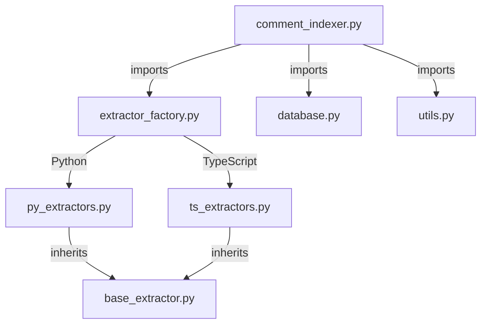

# PyCommentIndexer Technical Design

## Module Architecture



## Main Features
- 递归遍历指定目录下的Python/TypeScript文件（自动排除.venv目录）
- 提取代码注释：
  - Python: 使用AST解析文档字符串和tokenize提取行注释
  - TypeScript: 使用正则表达式匹配单行(//)和多行(/**/)注释
- 将原始注释保存到.raw目录便于调试
- 将注释与文件路径关联后存入Chroma向量数据库
- 提供CRUD操作和相似注释搜索功能

#### 设计思路
1. **注释提取**：使用AST解析文档字符串，配合tokenize获取行级注释
2. **原始存储**：将提取的注释以文本文件形式保存在.raw目录
3. **向量化存储**：用ChromaDB存储注释向量，文件路径作为唯一ID
4. **嵌入模型**：使用ChromaDB内置的all-MiniLM-L6-v2模型
5. **交互增强**：questionary实现交互式操作，Rich库美化输出
5. **错误处理**：对文件解析、DB操作和用户输入进行多层异常处理

**requirements.txt**
```txt
chromadb>=0.4.0
click>=8.1.0
rich>=13.0.0
questionary>=2.0.0
python-dotenv>=1.0.0
tqdm>=4.0.0
```

**环境配置**
```bash
# 创建虚拟环境
python3 -m venv .venv
source .venv/bin/activate

# 安装依赖
pip install -r requirements.txt
```

### 配置项
- `DEFAULT_DB_PATH`: 默认数据库存储路径 (默认值: `chroma_db`)

### 模块化代码结构

```bash
py-comment-indexer/
├── comment_indexer.py    # 主入口和CLI命令
├── database.py           # ChromaDB管理
├── extractor_factory.py  # 提取器工厂
├── base_extractor.py     # 抽象提取器基类
├── py_extractors.py      # Python注释提取器
├── ts_extractors.py      # TypeScript注释提取器
└── utils.py              # 工具函数
```

#### TypeScript提取器示例
```python
class TypeScriptExtractor(BaseExtractor):
    """TypeScript语言注释提取器"""
    
    @staticmethod
    def extract_comments(file_path: Path) -> str:
        # 匹配单行(//)和多行(/**/)注释
        pattern = r"(\/\/[^\n]*|\/\*[\s\S]*?\*\/)"
        content = file_path.read_text(encoding="utf-8")
        return " ".join(match.strip() 
                      for match in re.findall(pattern, content))
```

#### Python提取器示例
```python
class PythonExtractor(BaseExtractor):
    """Python语言注释提取器"""
    
    @staticmethod
    def extract_comments(file_path: Path) -> str:
        return (PythonExtractor.extract_docstrings(file_path) + " " +
                PythonExtractor.extract_line_comments(file_path))
```

#### database.py (数据库模块)
```python
class ChromaManager:
    """管理ChromaDB连接和操作"""
    
    def __init__(self, db_path: str = DEFAULT_DB_PATH):
        """初始化ChromaDB客户端"""
        
    def get_collection(self) -> chromadb.Collection:
        """获取或创建注释集合（使用ChromaDB内置嵌入模型）"""
        
    def clear_database(self) -> None:
        """清空整个数据库"""
        
    def add_comments(self, comment_dict: CommentDict, batch_size=100) -> None:
        """批量添加注释到数据库"""
        
    def query_similar(self, query: str, n_results=5) -> List[Tuple[str, float]]:
        """查询相似注释"""
```

#### utils.py (工具模块)
```python
def scan_python_files(directory: Path) -> List[Path]:
    """递归扫描目录中的Python文件"""
    
def confirm_dangerous(action: str) -> bool:
    """危险操作确认提示"""
```

#### comment_indexer.py (主模块)
```python
#!/usr/bin/env python3
# -*- coding: utf-8 -*-
"""
PyCommentIndexer - Python注释向量化索引工具
将代码注释存入ChromaDB实现语义搜索
"""

import logging
from pathlib import Path
from typing import List, Tuple
from tqdm import tqdm

import click
from rich import print
from rich.logging import RichHandler
import questionary
from dotenv import load_dotenv

from extractor_factory import ExtractorFactory
from database import ChromaManager, CommentDict
from utils import scan_source_files, confirm_dangerous

# 配置彩色日志
logging.basicConfig(
    level=logging.INFO,
    format="%(message)s",
    handlers=[RichHandler(rich_tracebacks=True)]
)
logger = logging.getLogger("PyCommentIndexer")

# ---------------------- CLI命令实现 ----------------------
@click.group()
@click.option("--verbose", is_flag=True, help="显示调试信息")
def cli(verbose):
    """Python注释向量化索引工具"""
    if verbose:
        logger.setLevel(logging.DEBUG)
        logger.debug("调试模式已启用")

def scan_source_files(directory: Path) -> List[Path]:
    """递归扫描目录中的源代码文件"""
    return [
        p for p in directory.rglob("*.*")
        if p.suffix in ('.py', '.ts')
        and p.is_file()
        and not p.name.startswith(".")
    ]

def confirm_dangerous(action: str) -> bool:
    """危险操作确认提示"""
    question = {
        "type": "confirm",
        "name": "confirm",
        "message": f"你确定要{action}吗？",
        "default": False
    }
    return prompt([question]).get("confirm", False)

@cli.command()
@click.argument("directory", type=click.Path(exists=True), required=False)
def init(directory):
    """初始化数据库（当首次使用时自动调用）"""
    db = ChromaManager()
    print(f"[bold green]✓ ChromaDB已初始化在 {DEFAULT_DB_PATH}[/]")

@cli.command()
@click.argument("directory", type=click.Path(exists=True), default=".")
@click.option("--batch", default=100, help="批量操作大小")
def add(directory, batch):
    """添加目录中的注释到数据库"""
    base_dir = Path(directory)
    py_files = scan_python_files(base_dir)
    if not py_files:
        print("[yellow]! 未找到Python文件[/]")
        return
  
    db = ChromaManager()
    comment_dict = {}
  
    print(f"[bold]扫描到 {len(py_files)} 个Python文件:[/]")
    for file in tqdm(py_files, desc="处理文件中"):
        rel_path = str(file.relative_to(base_dir))
        comment_dict[rel_path] = CommentExtractor.extract_comments(file)
  
    # 过滤空注释文件
    valid_files = {k:v for k,v in comment_dict.items() if v.strip()}
    print(f"找到{len(valid_files)}个有注释的文件 (已跳过{len(py_files)-len(valid_files)}个空文件)")
  
    if valid_files:
        db.add_comments(valid_files, batch_size=batch)
        print(f"[bold green]✓ 已添加{len(valid_files)}个文件注释到数据库[/]")
    else:
        print("[yellow]! 无有效注释可添加[/]")

@cli.command()
@click.option("--query", "-q", help="直接输入查询字符串")
def search(query):
    """查询相似注释（支持交互）"""
    if not query:
        user_query = questionary.text("输入要查询的注释关键词:").ask().strip()
        if not user_query:
            return
    else:
        user_query = query
  
    db = ChromaManager()
    results = db.query_similar(user_query)
  
    if results:
        print(f"[bold]与'[cyan]{user_query}[/cyan]'相似的注释:[/]")
        for i, (file_path, score) in enumerate(results, 1):
            print(f"  {i}. [yellow]\[相似度:{score}][/] [green]{file_path}[/]")
    else:
        print("[yellow]! 未找到匹配结果[/]")

@cli.command()
def clear():
    """清空整个数据库（需确认）"""
    if confirm_dangerous("清空数据库吗？操作不可逆！"):
        db = ChromaManager()
        db.clear_database()

# ---------------------- 主入口 ----------------------
if __name__ == "__main__":
    load_dotenv()  # 加载环境变量
    cli()
```

### 使用说明

#### 原始注释文件
运行`add`命令后，会在`.raw`目录生成原始注释文本文件，文件名格式为`[源文件相对路径].txt`

#### 基本命令
1. **初始化数据库**（自动创建存储目录）:
   ```bash
   python comment_indexer.py init
   ```

2. **索引注释**（扫描指定目录）:
   ```bash
   python comment_indexer.py add /path/to/code
   # 使用当前目录
   python comment_indexer.py add
   ```

3. **搜索注释**:
   ```bash
   # 命令行直接查询
   python comment_indexer.py search -q "数据库连接"
   # 交互模式
   python comment_indexer.py search
   ```

4. **清空数据库**（高危操作）:
   ```bash
   python comment_indexer.py clear
   ```

#### 使用示例
```bash
# 创建测试文件
mkdir test_project
# Python示例
echo \"\"\"
数据库配置模块
\"\"\n\n# 重要: MySQL连接设置 > test_project/db.py

# TypeScript示例
echo "// API配置\ninterface Config {\n  /* 基础URL */\n  baseUrl: string\n}" > test_project/api.ts

# 索引并搜索
python comment_indexer.py add test_project
python comment_indexer.py search -q "配置"

# 输出结果
[bold]与'配置'相似的注释:[/]
  1. [相似度:0.92] db.py
  2. [相似度:0.88] api.ts
```

### 设计亮点
1. **智能解析**：AST+tokenize双模式精准提取注释
2. **内存优化**：分批写入防止内存溢出
3. **交互友好**：
   - Rich彩色输出
   - PyInquirer交互调查
   - 危险操作二次确认
4. **健壮性**：
   - 异常文件跳过机制
   - 语法错误自动处理
   - 详细操作日志

> ChromaDB会自动管理内置的all-MiniLM-L6-v2模型

## 已知问题

### ChromaDB遥测功能冲突
- **现象**：初始化时出现 `posthog.capture() takes 1 positional argument but 3 were given` 错误
- **原因**：ChromaDB内置的遥测功能与posthog库存在API兼容性问题
- **解决方案**：
  1. 代码中设置环境变量：
     ```python
     import os
     os.environ["CHROMA_TELEMETRY"] = "false"  # 完全禁用遥测
     ```
  2. 或在运行前设置环境变量：
     ```bash
     CHROMA_TELEMETRY=false python comment_indexer.py init
     ```
